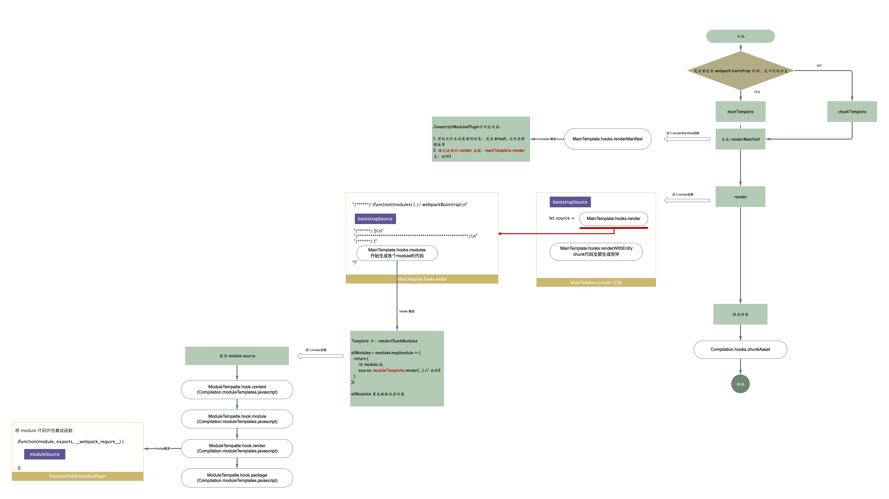
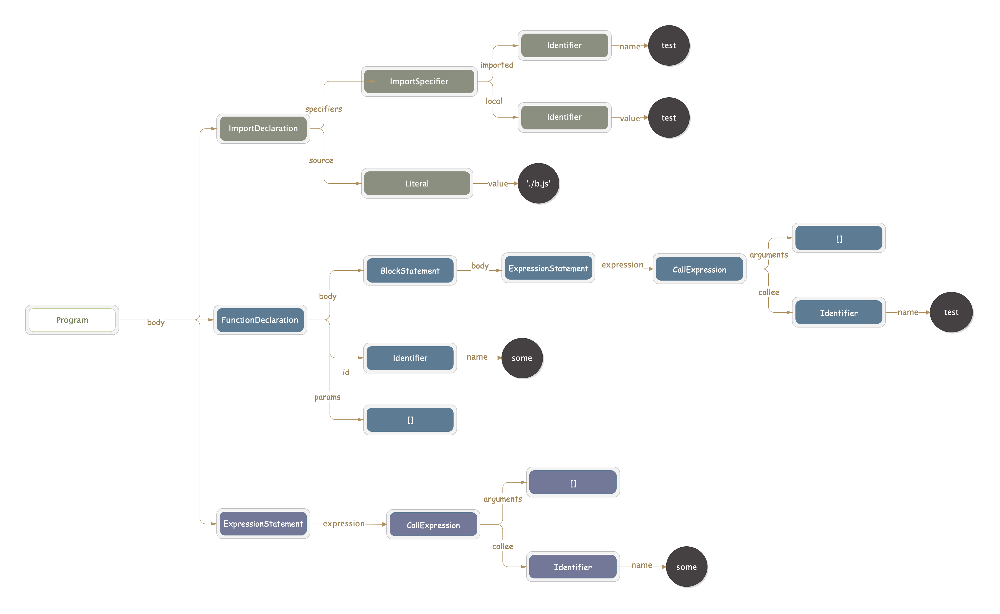
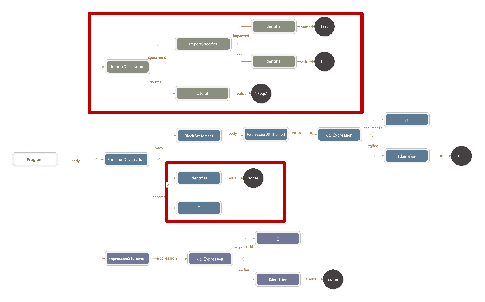
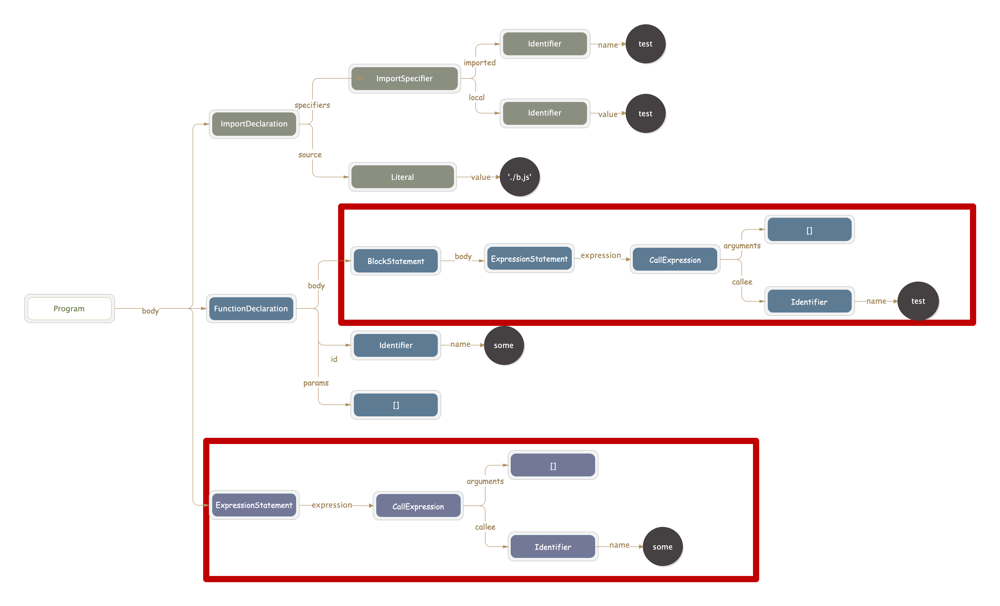
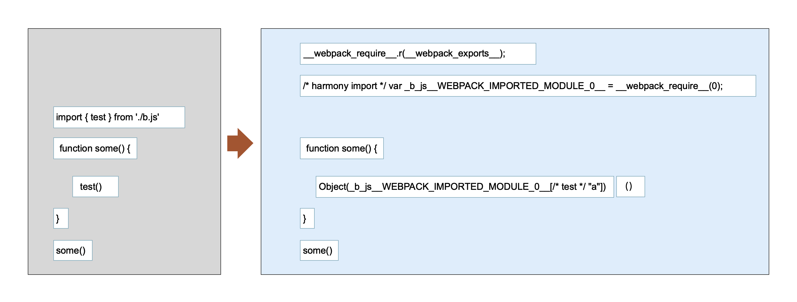

## 静态文件生成过程

#### 一些概念说明

Compilation 初始化的时候会初始化下面几个变量：

```javascript
this.mainTemplate = new MainTemplate(...)
this.chunkTemplate = new ChunkTemplate(...)
this.runtimeTemplate = new RuntimeTemplate
this.moduleTemplates = {
   javascript: new ModuleTemplate(this.runtimeTemplate, "javascript"),
   webassembly: new ModuleTemplate(this.runtimeTemplate, "webassembly")
}
this.hotUpdateChunkTemplate // 暂时不关注
```

mainTemplate:  用来生成执行主流程的代码，里面包含了 webpack 的启动代码等等。
chunkTemplate: 得到的最终代码则会通过 JsonP 的方式来加载。

下面的例子：
我们有一个入口文件：

```javascript
// main.js
import { Vue } from 'vue'
new Vue(...)
```

这样的文件打包后生成一个 app.js ，一个 chunk-vendor.js。

app.js 结构如下：

```javascript
 (function(modules) { // webpackBootstrap
   // webpack 的启动函数
   // webpack 内置的方法
 }){{
   moduleId: (function(module, exports, __webpack_require__) {
      // 我们写的 js 代码都在各个 module 中
   },
   // ...
 })
```

chunk-vendors.js 结构如下：

```javascript
(window["webpackJsonp"] = window["webpackJsonp"] || []).push([["chunk-vendors"],{
   moduleId: (function(module, exports, __webpack_require__) {
     // ...
   },
   // ...
})
```

app.js 里面包含了 webpack 的 bootstrap 代码，这个代码整体的框架j就在 mainTemplate。

app.js 会通过 jonsP 的方式加载 chunk-vendor.js ，这个 js 代码的框架就放在 chunkTemplate 中。

app.js 和 chunk-vendors.js 中各个 module 的代码生成过程就在 ModuleTempalte 中。


#### 代码生成主流程

chunk 代码生成在 seal 阶段。从 `Compilation.createChunkAssets` 中开始。

主流程图如下



> **说明1：**在 JavascriptModulePlugin中会确定 render 函数。这个 render 函数后续在 createChunkAssets 中会调用。

> **说明2：**这里 moduleTemplate 在 Compilation 一开始初始化会生成
>
> ```javascript
> this.moduleTemplates = {
> 	javascript: new ModuleTemplate(this.runtimeTemplate, "javascript"),
> 	webassembly: new ModuleTemplate(this.runtimeTemplate, "webassembly")
> };
> ```
>
> 由于走到是 mainTemplate，在最开始获取 render 各种信息的函数中 `renderManifest` 为触发 `JavascriptModulesPlugin` 中注册的函数，而这个里面确定了 module 所使用的模板为 `moduleTemplates.javascript`
>
> ```javascript
> compilation.mainTemplate.hooks.renderManifest.tap(
>   "JavascriptModulesPlugin",
>   (result, options) => {
>     //...
>     result.push({
>       render: () =>
>       compilation.mainTemplate.render(
>         hash,
>         chunk,
>         moduleTemplates.javascript,
>         dependencyTemplates
>       ),
>       //...
>     });
>     return result;
>   }
> );
> ```
>
> **说明3：** module-source 的过程见最后附加内容

首先确定当前结构是使用 mainTemplate 还是走 chunkTemplate。这两个 Tempalte 中会有自己的 render 流程。我们以 mainTempalte 为例，看 render 的流程。

render 主流程中会生成主结构的代码，也就是前面我们 app.js demo 生成的代码框架部分。然后生成各个 moulde 的代码。这个流程由 ModuleTemplate 中的函数完成。

在 module 生成的时候，会调用 `hook.content, hook.module, hook.render, hook.package`这几个 hook。在每一个 hook 得到结果之后，传入到下一个 hook 中。`hook.module` 这个 hook 执行完后，会得到 module 的代码。然后在 `hook.render` 中，将这些代码包裹成一个函数。如果我们在 `webpack.config.js` 中配置了 `output.pathinfo=true` ([配置说明](https://webpack.js.org/configuration/output/#outputpathinfo))，那么在 `hook.package`这里就会给最终生成的代码添加一些路径和 tree-shaking 相关的注释，可以方便我们阅读代码。

得到所有的 module 代码之后，将它们包裹成数组或者对象。

#### 修改代码

- 利用上面文件生成的 hook, 在某个 module 中添加额外内容

bannerPlugin 是在 chunk 文件开头添加额外的内容。如果我们仅仅是希望在某个 module 中添加内容如何做呢？回顾一下上面代码生成的流程图，module 代码生成有几个关键的 hook 例如 `hook.content,hook.module,hook.render`。可以在这几个 hook 中注册函数来进行修改。一个简单的 demo 如下

```javascript
const { ConcatSource } = require("webpack-sources");
class AddExternalPlugin {
  constructor(options) {
    // plugin 初始化。这里处理一些参数格式化等
    this.content = options.content // 获取要添加的内容
  }
  apply(compiler) {
    const content = this.content
    compiler.hooks.compilation.tap('AddExternal', compilation => {
      compilation.moduleTemplates.javascript.hooks.render.tap('AddExternal', (
        moduleSource,
        module ) => {
          // 这里会传入 module 参数，我们可以配置，指定在某一 module 中执行下面的逻辑
          // ConcatSource 意味着最后处理的时候，我们 add 到里面的代码，会直接拼接。
          const source = new ConcatSource()
          // 在最开始插入我们要添加的内容
          source.add(content)
          // 插入源码
          source.add(moduleSource)
          // 返回新的源码
          return source
      })
    })
  }
}
```


- 在 chunk 执行代码外再包裹一层额外的逻辑。

我们曾经配置过 umd 的模式，或者 `output.library` 参数。配置了这俩内容之后，最后生成的代码结构就和最开始 app.js demo 中的结果不一样了。以 `output.library='someLibName'` 为例，会变成下面这样

```javascript
var someLibName =
(function(modules){
// webpackBootstrap
})([
//... 各个module
])
```

这个的实现，就是在上面 `hooks.renderWithEntry` 环节对 mainTemplate 生成的代码进行了修改。

如果我们在某些情况下，想额外包裹一些自己的逻辑。可以就在这里处理。给一个简单的 demo

```javascript
const { ConcatSource } = require("webpack-sources");
class MyWrapPlugin {
  constructor(options) {
  }
  apply(compiler) {
    const onRenderWithEntry = (source, chunk, hash) => {
      const newSource = new ConcatSource()
      newSource.add(`var myLib =`)
      newSource.add(source)
      newSource.add(`\nconsole.log(myLib)`)
      return newSource
    }
    compiler.hooks.compilation.tap('MyWrapPlugin', compilation => {
      const { mainTemplate } = compilation
      mainTemplate.hooks.renderWithEntry.tap(
        "MyWrapPlugin",
        onRenderWithEntry
      )
      // 如果我们支持一些变量的配置化，那么就需要把我们配置的信息写入 hash 中。否则，当我们修改配置的时候，会发现 hash 值不会变化。
      // mainTemplate.hooks.hash.tap("SetVarMainTemplatePlugin", hash => {
      // 	hash.update()
      // });
    })
  }
}

module.exports = MyWrapPlugin
```

webpack编译后结果

```javascript
var myLib =/******/ (function(modules) {
//... webpack bootstrap 代码
/******/  return __webpack_require__(__webpack_require__.s = 0);
/******/ })
/************************************************************************/
/******/ ([
/* 0 */
/***/ (function(module, exports) {
// ...
/***/ })
/******/ ])
console.log(myLib);
```

- bannerPlugin

类似内置的 bannerPlugin。在上面 chunk 文件生成之后，也就是`createChunkAssets`执行完成之后，对整体的 chunk 文件内容进行修改。例如 bannerPlugin 是在 `optimizaChunkAssets` hook 中

在这个 hook 里面可以拿到一个参数 `chunks` 所有的 chunk，然后在这里可以添加额外的内容。


#### chunkAssets 后文件内容修改

createChunkAssets 执行过后，其他的 hook 中可可以拿到文件内容，进行修改。

- sourmap 的影响，afterOptimizeChunkAssets 这个 hook 之后，webpack 生成了 sourcemap。如果在这个之后进行代码的修改，例如 optimizeAssets 或者更后面的 emit hook 中，会发现 sourcemap 不对了。像下面的例子

  ```javascript
  compiler.hooks.compilation.tap('AddExternal', compilation => {
    compilation.hooks.optimizeAssets.tap('AddExternal', assets => {
      let main = assets["main.js"]
      main = main.children.unshift('//test\n//test\n')
    })
  })
  ```

- 对 hash 的影响。当上面 chunk 代码生成结束后，其实 hash 也就随着生成了。在hash生成完之后的 hook 中对代码的修改，比如增加点啥，不会影响到 hash 的结果。例如上面修改 chunk 代码的例子。假如我们的 plugin 进行了升级，修改的内容变了，但是生成的 hash 并不会随着改变。所以需要在 hash 生成相关的 hook 中，把 plugin 的内容写入 hash 中。


### module-source 生成

module-source 的过程中会对 parser 阶段生成的各个 dependency 进行处理，根据 dependency.Template 实现对我们缩写的源码的转换。这里我们结合最开始 parser 来一起看 module-source。以下面 demo 为例：

```javascript
// main.js
import { test } from './b.js'
function some() {
  test()
}
some()

// b.js
export function test() {
  console.log('b2')
}
```


main.js parser 中转成的 AST:



对 ast 进行 parser ，这个过程中，会经历

```javascript
if (this.hooks.program.call(ast, comments) === undefined) {
  this.detectMode(ast.body);
  this.prewalkStatements(ast.body);
  this.blockPrewalkStatements(ast.body);
  this.walkStatements(ast.body);
}
```

- program

  检测有没有用到 import/export ，会增加 HarmonyCompatibilityDependency, HarmonyInitDependency(作用后面介绍)

- detectMode

  检测最开始是否有 `use strict` 和 `use asm`，为了保证我们代码编译之后开头写的 use strict 仍然在最开始

- prewalkStatements

  遍历当前作用域下所有的变量定义。这个过程中`import { test } from './b.js'` 中 test 也是在当前作用域下的，所以 import 在这里会被处理(过程见 javascript-parser)。针对这句 import 会额外被添加`ConstDependency`和`HarmonyImportSideEffectDependency`

  

- blockPrewalk

  处理当前作用域下 let/const（在 prewalk 的时候只会处理var），class 名，export 和 export default

- walkStatements

  开始深入每一个节点进行处理。这里会找到代码中所有使用 `test` 的地方，然后添加 `HarmonyImportSpecifierDependency`
  
  


经理过这些之后，对于上面的 demo 就会加入

> HarmonyCompatibilityDependency 
>
> HarmonyInitDependency
>
> ConstDependency
>
> HarmonyImportSideEffectDependency 
>
> HarmonyImportSpecifierDependency

这些 dependency 分成两大类：

- moduleDependency: 有对应的 denpendencyFactory，在 processModuleDependencies 过程中会对这个 dependency 进行处理，得到对应的 module

  `HarmonyImportSideEffectDependency  --> NormalModuleFactory`

  `HarmonyImportSpecifierDependency  --> NormalModuleFactory`

  两个指向的是同一个 module(./b.js)，所以会被去重。然后 webpack 沿着 dependency ，处理 b.js... 直到将所有的 moduleDependency 处理完

  

- 仅文件生成的时候，用来生成代码


#### module.source


首先拿到源码代码，然后处理各个 dependency

- HarmonyCompatibilityDependency

  在开始插入 `__webpack_require__.r(__webpack_exports__);`，标识这是一个 esModule

- HarmonyInitDependency 

  遍历所有的 dependency, 负责生成 `import {test} from './b.js'` 对应的引入 './b.js' 模块的代码

  `/* harmony import */ var _b_js__WEBPACK_IMPORTED_MODULE_0__ = __webpack_require__(0);`
  
- ConstDependency

  在 HarmonyInitDependency 阶段中，已经插入了 `import` 语句对应的内容，所以源码中的 `import {test} from './b.js'`需要删除掉。ConstDependency 的作用就是把这句替换成空，即删除

-  HarmonyImportSideEffectDependency

  作用阶段在 HarmonyInitDependency 过程中

- HarmonyImportSpecifierDependency 

  代码中 `test()` 所生成的依赖。作用就是替换代码中的 `test`

  - 获取到 './b.js' 模块对应的变量名 `_b_js__WEBPACK_IMPORTED_MODULE_0__`

  - 获取 test 对应到 b.js 中的属性名(因为经过 webpack 编译，为了简化代码，我们在 b.js 中的 export test，可能会被转为 export a = test)

    `Object(_b_js__WEBPACK_IMPORTED_MODULE_0__[/* test */ "a"])`

    > 如果是被调用的话，会走一个逻辑??
    >
    > ```
    > if (isCall) {
    > 				if (callContext === false && asiSafe) {
    > 					return `(0,${access})`;
    > 				} else if (callContext === false) {
    > 					return `Object(${access})`;
    > 				}
    > 			}
    > ```

  - 然后替换代码中 test

经过所有的 dependency 之后：



了解了这个过程之后，如果我们需要对源代码中进行一些简单的修改，可以利用 parser 阶段的各个 hook 来实现。在这里修改有一个好处，不用担心搞坏 sourcemap 和 影响 hash 的生成。

-  parser 中插入代码的 demo

  例如，我们使用某个插件的时候，需要下面的写法

  ```javascript
  import MainFunction from './a.js'
  import { test } from './b.js'
  MainFunction.use(test)
  ```

  实际中利用 webpack 插件，在检测到有 test 引入时候，自动插入

  ```javascript
  import MainFunction from './a.js'
  MainFunction.use(test)
  ```

  实现的关键，就是上面提到的 `HarmonyImportSideEffectDependency`,  `HarmonyImportSpecifierDependency` 和 `ConstDependency`

  代码如下

  ```javascript
  const path = require('path')
  const ConstDependency = require("webpack/lib/dependencies/ConstDependency");
  const HarmonyImportSideEffectDependency = require("webpack/lib/dependencies/HarmonyImportSideEffectDependency")
  const HarmonyImportSpecifierDependency = require("webpack/lib/dependencies/HarmonyImportSpecifierDependency")
  const NullFactory = require("webpack/lib/NullFactory");
  
  // 要引入的 a.js 的路径。这个路径后面会经过 webpack 的 resolve
  const externalJSPath = `${path.join(__dirname, './a.js')}`
  
  class ProvidePlugin {
  	constructor() {
  	}
  	apply(compiler) {
  		compiler.hooks.compilation.tap(
  			"InjectPlugin",
  			(compilation, { normalModuleFactory }) => {
  				const handler = (parser, parserOptions) => {
            // 在 parser 处理 import 语句的时候
            parser.hooks.import.tap('InjectPlugin', (statement, source) => {
              parser.state.lastHarmonyImportOrder = (parser.state.lastHarmonyImportOrder || 0) + 1;
              // 新建一个 './a.js' 的依赖
              const sideEffectDep = new HarmonyImportSideEffectDependency(
                externalJSPath,
                parser.state.module,
                parser.state.lastHarmonyImportOrder,
                parser.state.harmonyParserScope
              );
              // 为 dependency 设置一个位置。这里设置为和 import { test } from './b.js' 相同的位置，在代码进行插入的时候会插入到改句所在的地方。
              sideEffectDep.loc = {
                start: statement.start,
                end: statement.end
              }
              // 设置一下 renames，标识代码中 mainFunction 是从外部引入的
              parser.scope.renames.set('mainFunction', "imported var");
              // 把这个依赖加入到 module 的依赖中
              parser.state.module.addDependency(sideEffectDep);
              
              // -------------处理插入 mainFunction.use(test)------------
              if (!parser.state.harmonySpecifier) {
                parser.state.harmonySpecifier = new Map()
              }
              parser.state.harmonySpecifier.set('mainFunction', {
                source: externalJSPath,
                id: 'default',
                sourceOrder: parser.state.lastHarmonyImportOrder
              })
              // 针对 mainFunction.use 中的 mainFunction
              const mainFunction = new HarmonyImportSpecifierDependency(
                externalJSPath,
                parser.state.module,
                -1,
                parser.state.harmonyParserScope,
                'default',
                'mainFunction',
                [-1, -1], // 插入到代码最开始
                false
              )
              parser.state.module.addDependency(mainFunction)
              
              // 插入代码片段 .use(
              const constDep1 = new ConstDependency(
                '.use(',
                -1,
                true
              )
              parser.state.module.addDependency(constDep1)
              
              // 插入代码片段 test
              const useArgument = new HarmonyImportSpecifierDependency(
                source,
                parser.state.module,
                -1,
                parser.state.harmonyParserScope,
                'test',
                'test',
                [-1, -1],
                false
              )
              parser.state.module.addDependency(useArgument)
              
              // 插入代码片段 )
              const constDep2 = new ConstDependency(
                ')\n',
                -1,
                true
              )
              parser.state.module.addDependency(constDep2)
            });
          }
  				normalModuleFactory.hooks.parser
  					.for("javascript/auto")
  					.tap("ProvidePlugin", handler);
  				normalModuleFactory.hooks.parser
  					.for("javascript/dynamic")
  					.tap("ProvidePlugin", handler);
  			}
  		);
  	}
  }
  module.exports = ProvidePlugin;
  
  ```

  生成的代码如下

  ```javascript
  /* 1 */
  /***/ (function(module, __webpack_exports__, __webpack_require__) {
  
  "use strict";
  const mainFunction = function () {
    console.log('mainFunction')
  }
  
  mainFunction.use = function(name) {
    console.log('load something')
  }
  /* harmony default export */ __webpack_exports__["a"] = (mainFunction);
  
  /***/ }),
  /* 2 */
  /***/ (function(module, __webpack_exports__, __webpack_require__) {
  
  "use strict";
  __webpack_require__.r(__webpack_exports__);
  /* harmony import */ var _Users_didi_Documents_learn_webpack_4_demo_banner_demo_a_js__WEBPACK_IMPORTED_MODULE_0__ = __webpack_require__(1);
  /* harmony import */ var _b_js__WEBPACK_IMPORTED_MODULE_1__ = __webpack_require__(0);
  _Users_didi_Documents_learn_webpack_4_demo_banner_demo_a_js__WEBPACK_IMPORTED_MODULE_0__[/* default */ "a"].use(_b_js__WEBPACK_IMPORTED_MODULE_1__[/* test */ "a"])
  
  Object(_b_js__WEBPACK_IMPORTED_MODULE_1__[/* test */ "a"])()
  
  /***/ })
  ```

  

- DefinePlugin

  [DefinePlugin 介绍](https://webpack.js.org/plugins/define-plugin/#usage)

  可以使用这个插件在编译阶段对一些常量进行替换的时候，例如:

  -  常用到的 js 代码中根据`process.env.NODE_ENV`的值，区分不同 dev 环境 和 production 环境。从而实现在不同环境下走不同的分支逻辑。

    ```javascript
    new DefinePlugin({
      'process.env.NODE_ENV': JSON.stringify(process.env.NODE_ENV)
    })
    ```

    

  - 可以配置 api URL

    ```javascript
    new DefinePlugin({
      API_DOMAIN: process.env.NODE_ENV === 'dev' ? '"//10.96.95.200"' : '"//api.didi.cn"'
    })
    ```

    实现 dev 和 production 下 api 请求域名的切换。

  简单介绍一些原理：一个最简单的例子

  ```
  new DefinePlugin({
    'TEST': "'test'"
  })
  ```

  代码中使用 `const a = TEST`, 在 parser 的时候遍历到 = 号右边的时候，会触发表达式解析的钩子

  ```javascript
  // key 是 TEST
  parser.hooks.expression.for(key).tap("DefinePlugin", expr => {
    const strCode = toCode(code, parser); // 结果为我们设置的 'test'
    if (/__webpack_require__/.test(strCode)) {
      // 如果用到了 __webpack_require__ ，生成的 ConstantDependency 中 requireWebpackRequire=true
      // 在后期生成代码，用 function(module, exports){} 将代码包裹起来的时候，参数里面会有 __webpack_require__，即 function(module, exports, __webpack_require__){} 
      return ParserHelpers.toConstantDependencyWithWebpackRequire(
        parser,
        strCode
      )(expr);
    } else {
      // ParserHelpers.toConstantDependency 会生成一个 ConstDependency，并且添加到当前的 module 中
      // ConstDependency.expression = "'test'"，位置就是我们代码中 TEST 对应的位置
      return ParserHelpers.toConstantDependency(
        parser,
        strCode
      )(expr);
    }
  });
  ```

  前面说过，ConstDependency 会对源码对应内容进行替换。所以在后面代码生成阶段执行下面的操作

  ```javascript
  ConstDependency.Template = class ConstDependencyTemplate {
  	apply(dep, source) {
      // 如果 range 是一个数字，则为插入；如果是一个区间，则为替换
  		if (typeof dep.range === "number") {
  			source.insert(dep.range, dep.expression);
  			return;
  		}
  		// 把源码中对应的地方替换成了 dep.expression，即 "test" 
  		source.replace(dep.range[0], dep.range[1] - 1, dep.expression);
  	}
  };
  ```

  这样便实现了，对源码中 TEST 的替换

 


